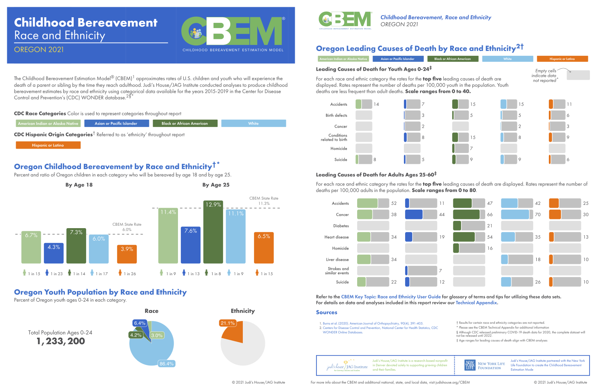
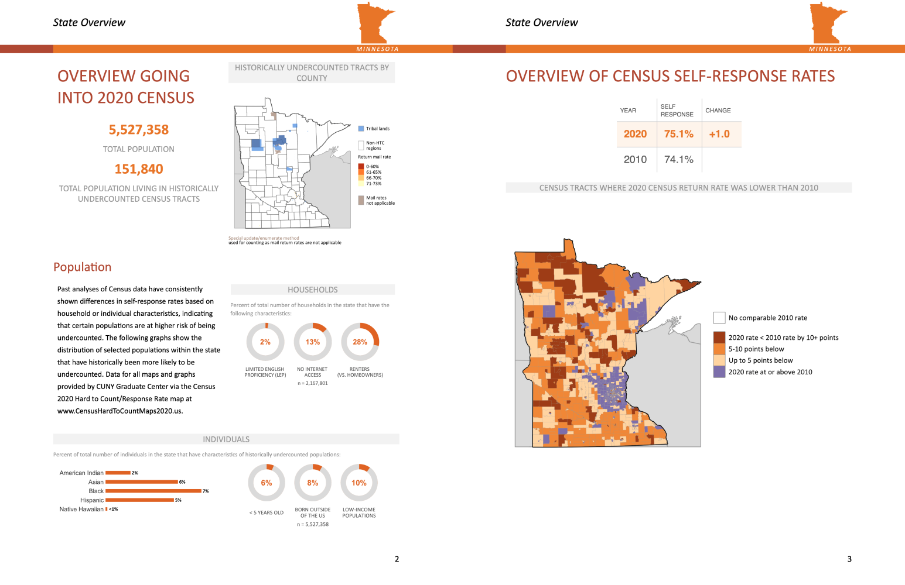
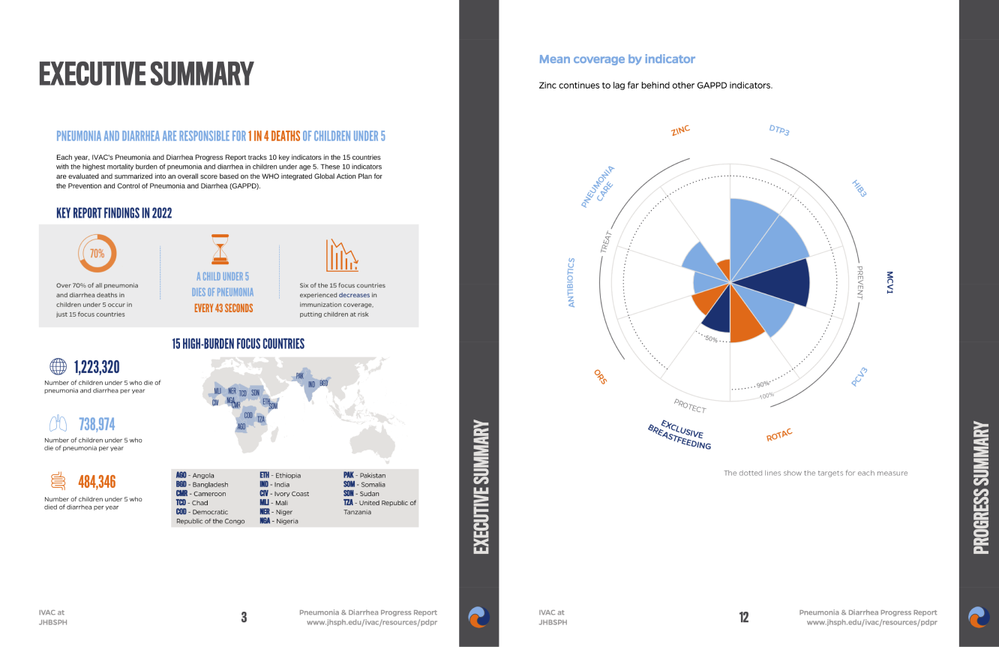
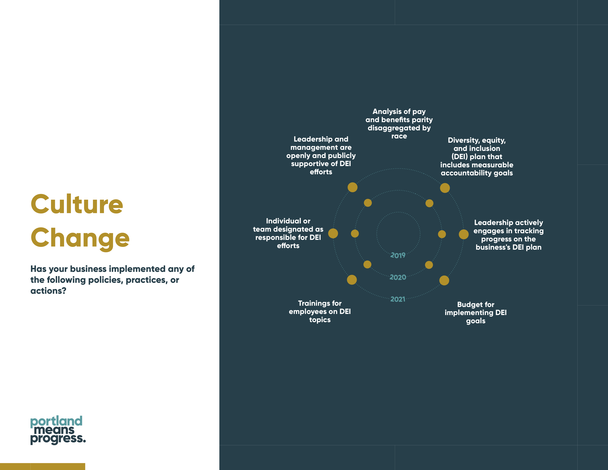
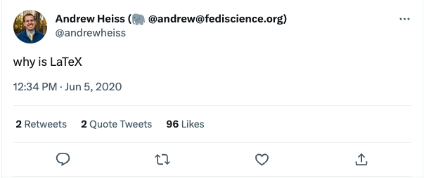
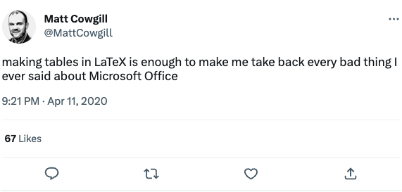
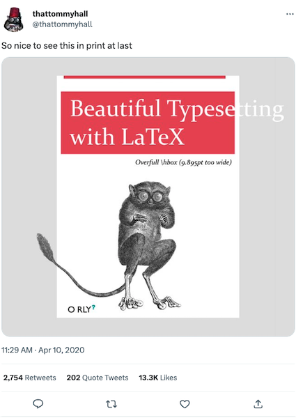
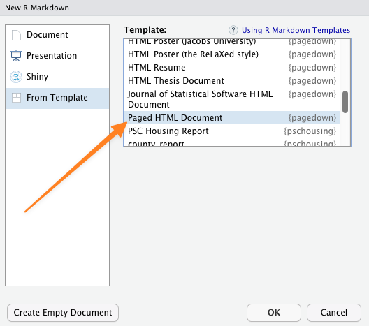
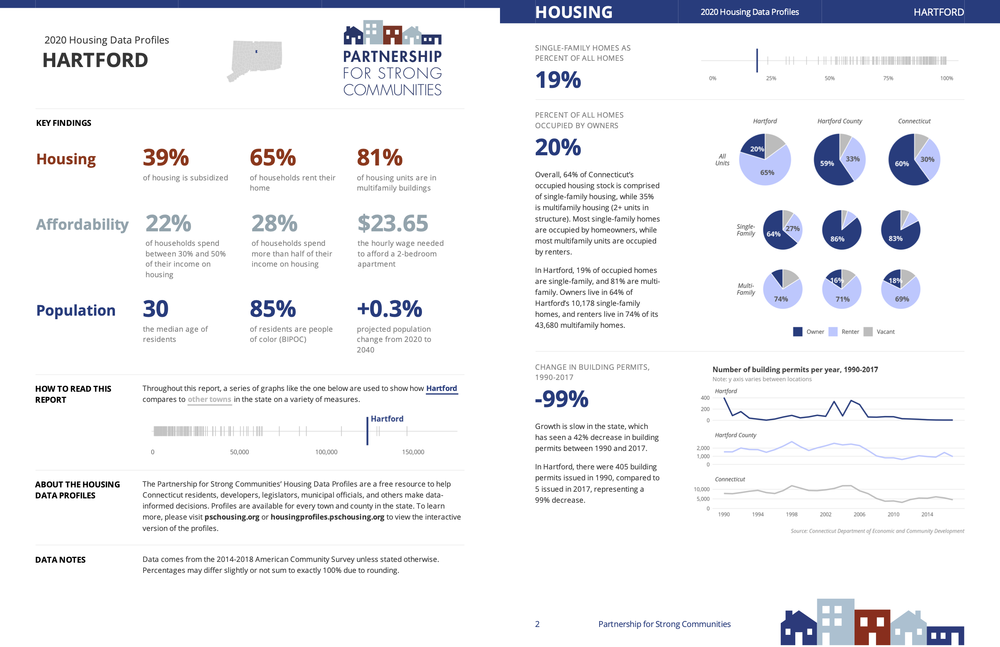
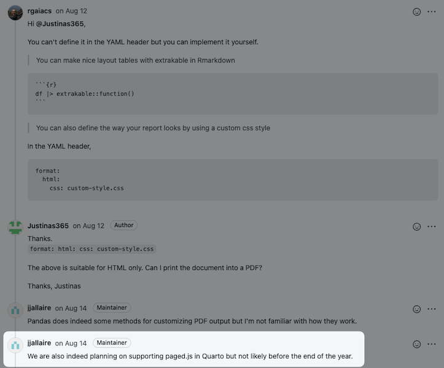

```{r setup, include=FALSE}
knitr::opts_chunk$set(echo = FALSE, 
                      warning = FALSE,
                      message = FALSE,
                      rows.print = 5)
```

```{r}
library(tidyverse)
```


class: inverse, center, middle

# Hi, I'm David

.headshot[

]


---

class: center, middle

```{r out.width="1000px"}

```

---

class: sample-report, center, middle



---

class: sample-report, center, middle



---

class: sample-report, center, middle




---

class: sample-report, center, middle




---

class: sample-report, center, middle


---


class: inverse, center, middle

background-image:url("img/page.jpg")

# `pagedown`

---

## The Problem

--

We often need to create PDF reports from RMarkdown

--

PDFs are portable

--

PDFs are widely used


---

## Potential Solution #1

Work with a graphic designer

---

class: center, middle


---

## Potential Solution #2


R users usually think of LaTex to make PDFs from RMarkdown, but there are some problems:

---

### The Default Output Looks Awful

--

```{r, out.height='250px', fig.align = 'center'}
knitr::include_graphics("https://i.stack.imgur.com/Nug7W.png", dpi = 300)
```

---

### LaTeX is Terrible

---

class: center, middle




```{r eval = FALSE}
tweetrmd::tweet_embed("https://twitter.com/andrewheiss/status/1268989566243004417",
                           align = "center")
```


---

class: center, middle



```{r eval = FALSE}
tweetrmd::tweet_embed("https://twitter.com/MattCowgill/status/1249190934392307712",
                      align = "center")
```

---

class: center, middle




```{r eval = FALSE}
tweetrmd::tweet_embed("https://twitter.com/thattommyhall/status/1248679614337241089",
                      maxwidth = 500,
                      align = "center")
```


---

class: inverse, center, middle

# The Solution: `pagedown`

---

## Why `pagedown`?

--

You can use tools like HTML and CSS to format your documents:

--

+ Way easier than LaTeX to learn

--

+ Easier to reuse parts on a website or in other formats (like `xaringan` or `blogdown`)

--

+ Outputs generally looks nicer than LaTeX


---

class: sample-report, center, middle


---

class: sample-report, center, middle


---

class: center, middle

```{r out.width='80%'}
knitr::include_graphics("img/cbem-sample.png", dpi = 300)
```


---

## How `pagedown` Works

--

**`pagedown`** is an R package that provides custom output formats:

--

+ you call it through `pagedown::html_paged` in the YAML header

--

+ and use the `css` argument to provide a custom style sheet

--

```{yaml, echo = TRUE, eval = FALSE}
---
  title: "My title"
date: "May 2022"
output: #<<
  pagedown::html_paged: #<<
  css: "style.css" #<<
knit: pagedown::chrome_print #<<
---
  ```


---

## Behind the Scenes

--


```{r, fig.align='left', out.height='300px', out.width='900px'}
knitr::include_graphics("img/pagedown_process.png", dpi = 300)
```

--

1. `pagedown` + `rmarkdown` translate the document into an **HTML** file (using Pandoc)

--

2. `pagedown` calls Paged.js, which puts things into the right place to look like "pages"

--

3. The `pagedown::chrome_print` function converts the HTML document to PDF


---

class: inverse, center, middle

# HTML and CSS

---

## HTML and CSS

--

- HTML creates the bricks of your document

--

+ Large brick (h1, h2, h3, etc)

--

+ Regular text brick (p)

--

- CSS is what the bricks look like

--

+ size

--

+ color

--

+ shape


---

class: center, middle


```{r out.width="800px"}
knitr::include_graphics("img/html-css-lego.png", dpi = 300)
```

---

## HTML in `pagedown`

`pagedown` uses the Paged.js library, which gives us some specific ways to format our document you won't see anywhere else in the world of HTML

---

class: center, middle


```{r out.width="45%"}
knitr::include_graphics("img/pagedjs-overview.png", dpi = 300)
```

---

class: inverse, center, middle

# Let's Make a `pagedown` Report!

---

## Install `pagedown`

```{r eval = FALSE, echo = TRUE}
install.packages("pagedown")
```

---

## Create a Document



---

class: inverse, center, middle

# Page Size


---

## Page Size


To handle pages, `pagedown` has a special CSS element called `@page`:

--

+ you can (and must) set its size at the beginning 

--

```{css, eval = FALSE, echo = TRUE}
@page {
size: 8.5in 11in;
}
```


---

class: inverse, center, middle

# Margins

---

## Margins

```{css, eval = FALSE, echo = TRUE}
:root {
--pagedjs-margin-left: 0.75in;
--pagedjs-margin-right: 0.75in;
--pagedjs-margin-bottom: 1.25in;
--pagedjs-margin-top: 1in;
}
```


---

class: inverse, center, middle

# Fonts

---

## Fonts

```{css, eval = FALSE, echo = TRUE}
@import url("https://fonts.googleapis.com/css2?family=Inter:wght@400;700&display=swap");
```

---

## Fonts

```{css, eval = FALSE, echo = TRUE}
body {
font-family: Inter, sans-serif;
}

h1, h2, h3, h4, h5, h6 {
font-weight: 700;
}

p {
font-size: 12pt;
}
```

---

## Fonts

```{css, eval = FALSE, echo = TRUE}
blockquote {
margin-inline-start: 0;
color: #6cabdd;
padding-left: 10pt;
border-left: 2pt solid #6cabdd;
font-style: italic;
}
```


---

class: inverse, center, middle

# Footer

---

class: center, middle

```{r out.width="45%"}
knitr::include_graphics("img/pagedjs-overview.png", dpi = 300)
```

---


## Footer

```{css, eval = FALSE, echo = TRUE}
@page {
size: 8.5in 11in;

@bottom-left-corner {
content: "";
background-image: url(rru-logo-blue.svg);
background-repeat: no-repeat;
background-size: 0.5in;
background-position: center;
}

@bottom-right-corner {
content: counter(page);
color: grey;
font-size: 10pt;
}

}
```

---

class: inverse, center, middle

# Cover Page


---

## Cover Page

```{css, eval = FALSE, echo = TRUE}
@page:first{
background: linear-gradient(130deg, black, transparent),
url(dark-hex-pattern.svg);
background-repeat: no-repeat;
background-size: cover;

@bottom-left-corner {
background: none;
}

@bottom-right-corner {
content: none;
}
};
```


---

## Cover Page

```{css, eval = FALSE, echo = TRUE}
h1.title {
color: white;
font-size: 36pt;
}

h2.date {
color: white;
font-weight: normal;
font-size: 18pt;
page-break-after: always;
}
```

---

class: inverse, center, middle

# Multicolumn Layouts

---

class: sample-report, center, middle





---

## Multicolumn Layouts

```{css, eval = FALSE, echo = TRUE}
img {
max-width: 100%;
}

.wrap-columns {
display: flex;
padding: 0 0pt;
}

.columns-50 {
flex: 50%;
}
```

---

class: inverse, center, middle

# Summing Up

---

## Summing Up

--

- You can make nice PDFs straight from R

--

- You do need to know some HTML and CSS

--

- At least it's not LaTeX!

---

class: inverse, center, middle

# Put Your Template in a Package

---

class: sample-report, center, middle


---

class: inverse, center, middle

# `pagedreport`

---

class: center, middle


pagedreport.rfortherestofus.com

---

class: inverse, center, middle

# Quarto?

---

class: center, middle



???

https://github.com/quarto-dev/quarto-cli/discussions/1716

---

class: inverse, center, middle

background-image:url("img/mine.jpg")

# Additional Resources

---

## Additional Resources

--

+ To learn more about `pagedown`, you can have a look at the [documentation](https://pagedown.rbind.io/) or the [issues](https://github.com/rstudio/pagedown/issues) on Github

--

+ To get a deeper knowledge of the foundations, look at the Paged.js [documentation](https://Pagedjs.org/documentation/) or their [Gitlab](https://gitlab.coko.foundation/Pagedjs/Pagedjs)

--

+ To learn HTML and CSS, you can either have a look at Mozilla tutorial ([HTML](https://developer.mozilla.org/en/docs/Web/HTML) + [CSS](https://developer.mozilla.org/en/docs/Web/CSS)) or the W3C tutorial ([HTML](https://www.w3schools.com/html/) + [CSS](https://www.w3schools.com/css/))
